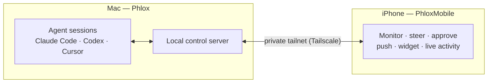

<div align="center">


# Phlox

**Claude Code、Codex、Cursor といった AI コーディングエージェントを、1つのネイティブ macOS
ワークスペースから実行・オーケストレーションできます。iOS コンパニオンアプリを使えば、どこからでもセッションを見守り、操作できます。**

<a href="https://phlox.cc"></a>

[](LICENSE)
[](#はじめに)
[](https://swift.org)
[](https://developer.apple.com/xcode/swiftui/)

[English](README.md) | [**日本語**](README.ja.md) | [简体中文](README.zh-CN.md) | [한국어](README.ko.md)


</div>

---

Phlox は1台の Mac を AI コーディングエージェントのための管制室に変えます。多数のセッションを
並べて起動し、ネイティブターミナルまたは構造化されたチャット UI からそれぞれを操作し、承認を
含むすべてを自分専用のプライベートネットワーク経由でスマートフォンから見守ることができます。

## 目次

- [ダウンロード](#ダウンロード)
- [機能](#機能)
- [仕組み](#仕組み)
- [モバイルコンパニオン](#モバイルコンパニオン)
- [リポジトリ構成](#リポジトリ構成)
- [はじめに](#はじめに)
- [コード署名](#コード署名)
- [セキュリティ](#セキュリティ)
- [コントリビューション](#コントリビューション)
- [ライセンスと通知](#ライセンスと通知)

## ダウンロード

Phlox を最も手早く試すなら、ビルド済みの macOS アプリを **[phlox.cc](https://phlox.cc)** からダウンロードしてください（[最新リリース](https://github.com/HMNZK/phlox/releases/latest) から直接取得も可）。ソースからのビルドや iOS コンパニオンについては [はじめに](#はじめに) を参照してください。

## 機能

- 🧠 **マルチエージェントワークスペース** — 多数のエージェントセッションを、それぞれ独立した
  PTY 内で並べて起動・管理できます。自由形式のターミナルセッションと構造化チャットモードを
  組み合わせられます。
- 💬 **構造化チャット** — 対応 CLI 上で動くネイティブなチャット UI。ツール呼び出しやサブ
  エージェントの可視化、承認ゲート、ターンごとのコスト・使用量表示を備えています。
- 🗂️ **グリッド＆ダッシュボード** — セッションをグリッド状に配置し、状態を一目で把握でき、
  完了をリアルタイムに追跡できます。
- 📱 **モバイルコンパニオン** — セッションを見守り、承認プロンプトに応答し、QR コードを
  スキャンして再接続できる iOS アプリ。すべてプライベートなオーバーレイネットワーク経由で
  行われます。
- 🔔 **常に把握** — プッシュ通知、ホーム画面ウィジェット、Live Activity がセッションの状態を
  リアルタイムに表示します。起動時のアプリロックには Face ID を利用できます。
- 🔌 **既存のエージェントをそのまま利用** — すでにインストール済みの Claude Code、Codex、
  Cursor の各 CLI を操作できます。

## 仕組み

Phlox はエージェント CLI を Mac 上でローカルに実行し（セッションごとに1つの PTY）、小さな
ローカル制御サーバーを公開します。iOS コンパニオンアプリはプライベートな
[Tailscale](https://tailscale.com/) tailnet 経由でこのサーバーに接続するため、スマートフォンは
Mac に直接到達し、データがサードパーティのサービスを経由することはありません。



## モバイルコンパニオン

**PhloxMobile** は Phlox の iOS 側です。プライベートな tailnet 経由で Mac に接続し、
どこにいてもセッションを前に進められます — あなたの応答を待っているセッションを確認し、
コマンドを承認/却下し、エージェントの質問にその場で回答できます。プッシュ通知・ホーム画面
ウィジェット・Live Activity がロック画面にライブ状態を表示し、起動時に Face ID でアプリを
ロックできます。

<table>
  <tr>
    <td width="33%"></td>
    <td width="33%"></td>
    <td width="33%"></td>
  </tr>
  <tr>
    <td align="center"><sub><b>セッション</b> — 誰の番かひと目で分かる</sub></td>
    <td align="center"><sub><b>承認</b> — 電話から承認/却下</sub></td>
    <td align="center"><sub><b>チャット</b> — 質問にその場で回答</sub></td>
  </tr>
</table>

## リポジトリ構成

このリポジトリは両方のアプリを含む monorepo です。

```
macos/   — the macOS app (SwiftUI + SwiftPM packages, generated with XcodeGen)
ios/     — the iOS companion app (SwiftUI + PhloxKit, generated with XcodeGen)
site/    — the project website and privacy policy (served at phlox.cc)
```

iOS アプリは、リポジトリ内のパス依存を通じて macOS アプリの共有 Swift パッケージ
（`AgentDomain`、`DesignSystem`）を再利用しています。

## はじめに

### 必要要件

- **macOS 14 以上** と **Xcode 16 以上**（Swift 6）。
- [XcodeGen](https://github.com/yonaskolb/XcodeGen) — `brew install xcodegen`。
  `.xcodeproj` ファイルは `project.yml` から生成されるため、コミットされていません。
- macOS アプリが操作するための、対応エージェント CLI が少なくとも1つインストールされている
  こと（例: Claude Code、Codex、Cursor）。
- **iOS コンパニオンアプリ（iOS 18 以上）を使う場合:** Mac とスマートフォンの間にプライベートな
  オーバーレイネットワークが必要です。Phlox は [Tailscale](https://tailscale.com/) を前提に
  設計されています — 両方のデバイスに Tailscale アプリをインストールし、同じ tailnet に
  参加してください。Phlox は Tailscale を同梱しておらず、ユーザーが用意した tailnet 経由で
  接続します。

### macOS アプリのビルド

```bash
cd macos
xcodegen generate
open Phlox.xcodeproj   # then build/run the "Phlox" scheme in Xcode
```

アプリをビルドせずにパッケージのテストを実行する:

```bash
cd macos/Packages/<PackageName> && swift test
```

### iOS コンパニオンアプリのビルド

```bash
cd ios
xcodegen generate
open PhloxMobile.xcodeproj   # build/run on a simulator or device
```

## コード署名

リポジトリで管理されている `project.yml` ファイルは **`DEVELOPMENT_TEAM` が空の状態** で
提供されているため、リポジトリ自体には個人の署名情報が含まれていません。実機向けにビルド
したり配布したりする場合は、Xcode の「Signing & Capabilities」タブか、ローカルの
`Signing.local.xcconfig`（[`Signing.example.xcconfig`](Signing.example.xcconfig) を参照）の
いずれかで、自分の Apple Developer Team ID を設定してください。シミュレーターやローカルの
テストビルドにはチーム設定は不要です。

## セキュリティ

Phlox は Mac をリモートから制御し、ローカルの制御サーバーを実行するため、セキュリティ報告は
真剣に受け止めています。脆弱性は非公開の方法で報告してください — [SECURITY.md](SECURITY.md)
を参照してください。セキュリティ上の問題について公開の issue を立てないでください。

## コントリビューション

Issue や Pull Request を歓迎します。サポートは保証されておらず、本ソフトウェアは MIT License
のもと現状有姿（as-is）で提供されます。

## ライセンスと通知

Phlox は [MIT License](LICENSE) のもとで公開されています。同梱されているサードパーティ製
コンポーネントおよび商標については [THIRD_PARTY_NOTICES.md](THIRD_PARTY_NOTICES.md) に
記載されています。

Phlox は独立したプロジェクトであり、OpenAI、Anthropic、Anysphere、Tailscale のいずれとも
提携関係にありません。これらの名称および商標は、互換性を示す目的でのみ使用しています。
