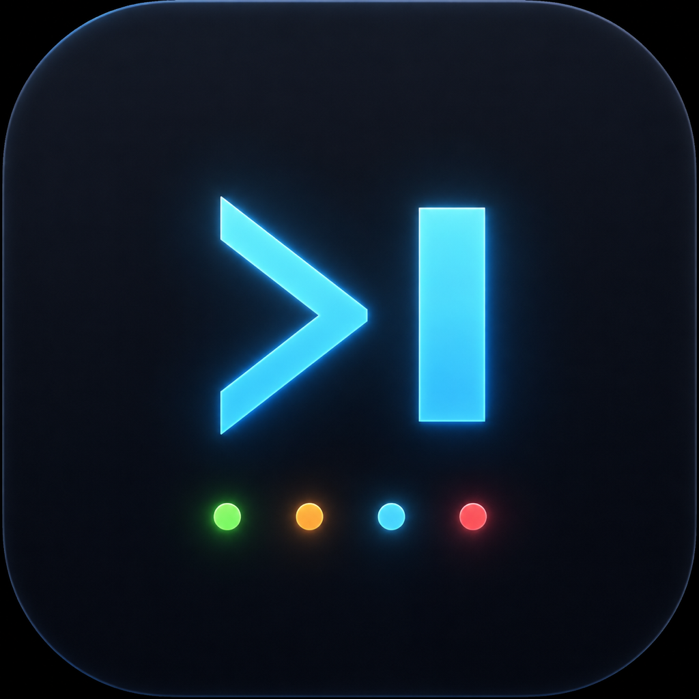
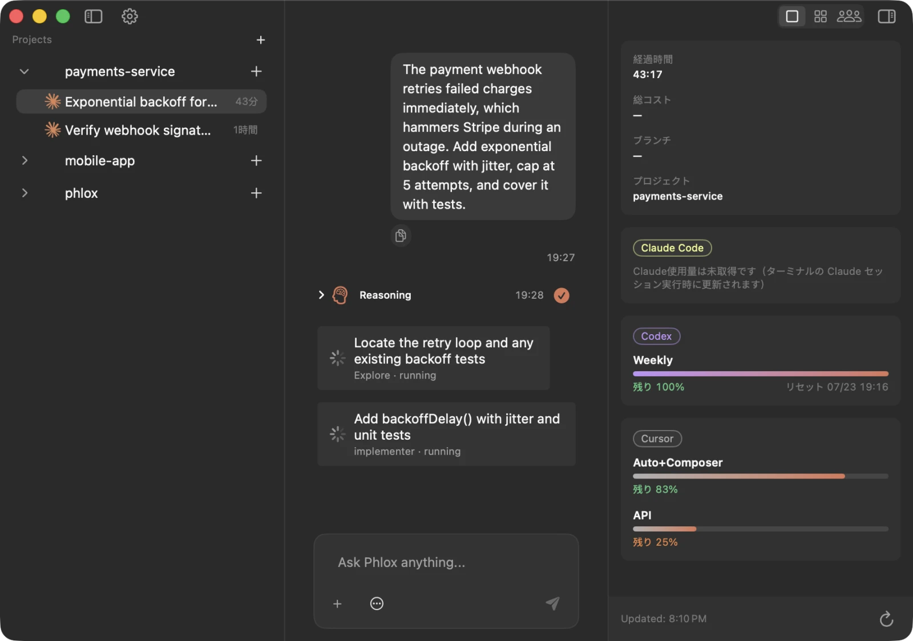
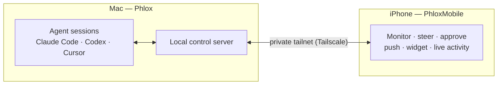
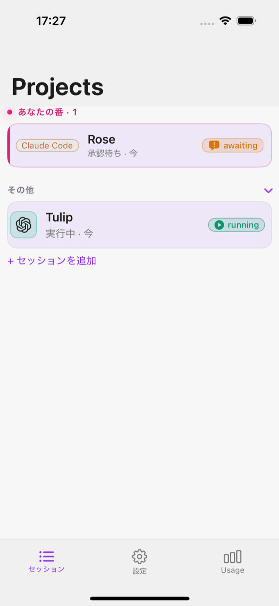
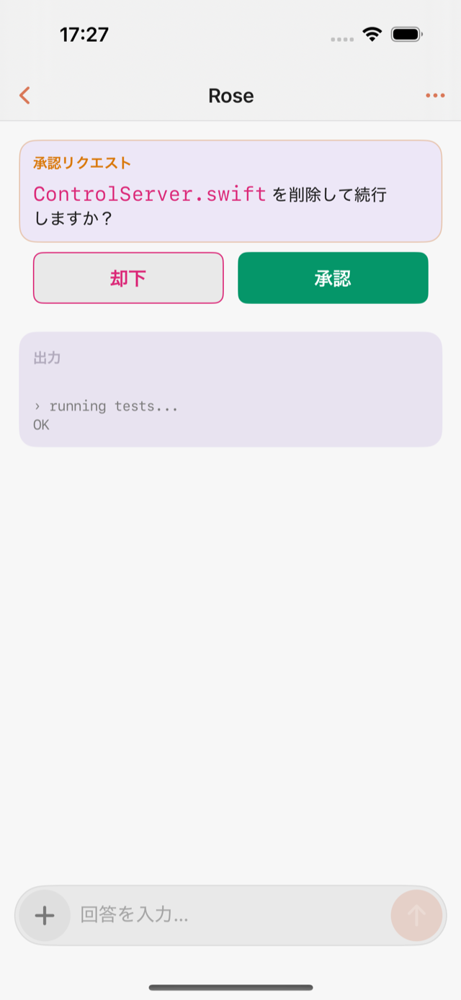
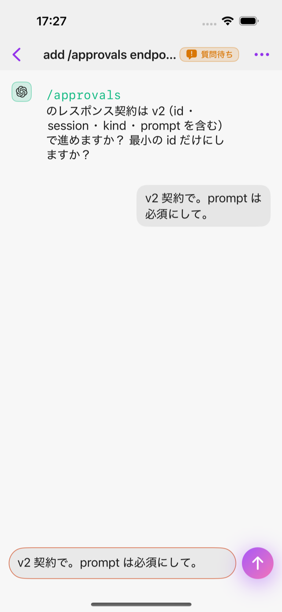

<div align="center">



# Phlox

**하나의 네이티브 macOS 워크스페이스에서 Claude Code, Codex, Cursor 등 AI 코딩
에이전트를 실행하고 오케스트레이션하세요. iOS 컴패니언 앱으로 어디서든 세션을
지켜보고 제어할 수 있습니다.**

<a href="https://phlox.cc"></a>

[](LICENSE)
[](#시작하기)
[](https://swift.org)
[](https://developer.apple.com/xcode/swiftui/)

[English](README.md) | [日本語](README.ja.md) | [简体中文](README.zh-CN.md) | [**한국어**](README.ko.md)



</div>

---

Phlox는 하나의 Mac을 AI 코딩 에이전트를 위한 관제실로 바꿔줍니다. 여러 세션을
나란히 생성하고, 네이티브 터미널이나 구조화된 채팅 UI로 각 세션을 제어하며,
승인 요청을 포함한 모든 상황을 나만의 프라이빗 네트워크를 통해 휴대폰에서
지켜볼 수 있습니다.

## 목차

- [다운로드](#다운로드)
- [기능](#기능)
- [작동 방식](#작동-방식)
- [모바일 컴패니언](#모바일-컴패니언)
- [저장소 구조](#저장소-구조)
- [시작하기](#시작하기)
- [코드 서명](#코드-서명)
- [보안](#보안)
- [기여하기](#기여하기)
- [라이선스 및 고지](#라이선스-및-고지)

## 다운로드

Phlox 를 가장 빠르게 사용해 보려면 미리 빌드된 macOS 앱을 **[phlox.cc](https://phlox.cc)** 에서 다운로드하세요([최신 릴리스](https://github.com/HMNZK/phlox/releases/latest)에서 직접 받을 수도 있습니다). 소스에서 빌드하거나 iOS 컴패니언을 실행하려면 [시작하기](#시작하기) 를 참고하세요.

## 기능

- 🧠 **멀티 에이전트 워크스페이스** — 여러 에이전트 세션을 나란히 생성하고
  관리하며, 각 세션은 독립된 PTY에서 실행됩니다. 자유형 터미널 세션과
  구조화된 채팅 모드를 함께 사용할 수 있습니다.
- 💬 **구조화된 채팅** — 지원되는 CLI 위에서 동작하는 네이티브 채팅 UI로,
  툴 호출과 서브 에이전트 가시성, 승인 게이트, 턴별 비용/사용량을 확인할 수
  있습니다.
- 🗂️ **그리드 & 대시보드** — 세션을 그리드로 배치하고 상태를 한눈에
  파악하며, 완료되는 작업을 실시간으로 추적합니다.
- 📱 **모바일 컴패니언** — 세션을 지켜보고 승인 요청에 응답하며, QR 코드를
  스캔해 재연결할 수 있는 iOS 앱 — 모두 프라이빗 오버레이 네트워크를 통해
  이루어집니다.
- 🔔 **놓치지 않기** — 푸시 알림, 홈 화면 위젯, Live Activity가 실시간 세션
  상태를 보여주며, Face ID로 앱 실행을 잠글 수 있습니다.
- 🔌 **원하는 에이전트를 그대로 사용** — 이미 설치되어 있는 Claude Code,
  Codex, Cursor CLI를 그대로 구동합니다.

## 작동 방식

Phlox는 에이전트 CLI를 Mac에서 로컬로 실행하고(세션당 하나의 PTY) 소규모
로컬 제어 서버를 노출합니다. iOS 컴패니언 앱은 프라이빗
[Tailscale](https://tailscale.com/) tailnet을 통해 이 서버에 연결되므로,
휴대폰이 Mac에 직접 접속하며 어떤 데이터도 제3자 서비스를 거치지 않습니다.



## 모바일 컴패니언

**PhloxMobile**은 Phlox의 iOS 파트너 앱입니다. 개인 tailnet을 통해 Mac에 연결되어 어디서든 세션을 계속 진행할 수 있게 해줍니다 — 어떤 세션이 당신을 필요로 하는지 확인하고, 명령을 승인하거나 거부하고, 에이전트의 질문에 바로 답변할 수 있습니다. 푸시 알림, 홈 화면 위젯, Live Activity가 잠금 화면에 실시간 상태를 유지해 주며, Face ID로 앱 실행 시 잠금을 걸 수 있습니다.

<table>
  <tr>
    <td width="33%"></td>
    <td width="33%"></td>
    <td width="33%"></td>
  </tr>
  <tr>
    <td align="center"><sub><b>세션</b> — 누구 차례인지 확인</sub></td>
    <td align="center"><sub><b>승인</b> — 휴대폰에서 승인 또는 거부</sub></td>
    <td align="center"><sub><b>채팅</b> — 에이전트의 질문에 바로 답변</sub></td>
  </tr>
</table>

## 저장소 구조

이 저장소는 두 앱을 모두 포함하는 모노레포입니다.

```
macos/   — the macOS app (SwiftUI + SwiftPM packages, generated with XcodeGen)
ios/     — the iOS companion app (SwiftUI + PhloxKit, generated with XcodeGen)
site/    — the project website and privacy policy (served at phlox.cc)
```

iOS 앱은 저장소 내부 경로 의존성을 통해 macOS 앱의 공유 Swift 패키지
(`AgentDomain`, `DesignSystem`)를 재사용합니다.

## 시작하기

### 요구 사항

- **macOS 14+**와 **Xcode 16+**(Swift 6).
- [XcodeGen](https://github.com/yonaskolb/XcodeGen) — `brew install xcodegen`.
  `.xcodeproj` 파일은 `project.yml`로부터 생성되며 커밋되지 않습니다.
- macOS 앱이 구동할, 지원되는 에이전트 CLI가 최소 1개 설치되어 있어야
  합니다(예: Claude Code, Codex, Cursor).
- **iOS 컴패니언 앱(iOS 18+)의 경우:** Mac과 휴대폰 사이에 프라이빗
  오버레이 네트워크가 필요합니다. Phlox는 [Tailscale](https://tailscale.com/)을
  기반으로 설계되었습니다 — 양쪽 기기에 Tailscale 앱을 설치하고 동일한
  tailnet에 참여하세요. Phlox는 Tailscale을 번들로 포함하지 않으며, 사용자가
  제공하는 tailnet을 통해 연결합니다.

### macOS 앱 빌드하기

```bash
cd macos
xcodegen generate
open Phlox.xcodeproj   # then build/run the "Phlox" scheme in Xcode
```

앱을 빌드하지 않고 패키지 테스트만 실행하려면:

```bash
cd macos/Packages/<PackageName> && swift test
```

### iOS 컴패니언 앱 빌드하기

```bash
cd ios
xcodegen generate
open PhloxMobile.xcodeproj   # build/run on a simulator or device
```

## 코드 서명

저장소에 포함된 `project.yml` 파일은 **`DEVELOPMENT_TEAM`이 비어 있는
상태**로 제공되므로, 저장소에는 개인 서명 아이덴티티가 포함되어 있지
않습니다. 실기기 빌드나 배포를 하려면 Xcode의 "Signing & Capabilities" 탭이나
로컬 `Signing.local.xcconfig`(참고: [`Signing.example.xcconfig`](Signing.example.xcconfig))를
통해 자신의 Apple Developer Team ID를 설정하세요. 시뮬레이터 및 로컬 테스트
빌드에는 팀 설정이 필요하지 않습니다.

## 보안

Phlox는 Mac을 원격으로 제어하고 로컬 제어 서버를 실행하므로, 보안 제보를
중요하게 다루고 있습니다. 취약점은 비공개로 제보해 주세요 —
[SECURITY.md](SECURITY.md)를 참고하세요. 보안 문제로 공개 이슈를 열지
마세요.

## 기여하기

이슈와 풀 리퀘스트를 환영합니다. 지원을 보장하지는 않으며, MIT 라이선스
하에 있는 그대로(as-is) 제공됩니다.

## 라이선스 및 고지

Phlox는 [MIT 라이선스](LICENSE)로 배포됩니다. 번들에 포함된 서드파티
구성 요소와 상표는 [THIRD_PARTY_NOTICES.md](THIRD_PARTY_NOTICES.md)에
기재되어 있습니다.

Phlox는 독립적인 프로젝트이며 OpenAI, Anthropic, Anysphere, Tailscale과는
관계가 없습니다. 이들의 이름과 상표는 호환성을 나타내기 위한 목적으로만
사용됩니다.
