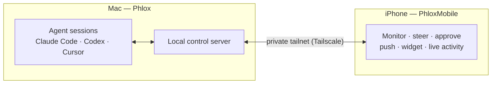

<div align="center">


# Phlox

**Run and orchestrate AI coding agents — Claude Code, Codex, and Cursor — from one
native macOS workspace, with an iOS companion to watch and steer your sessions from anywhere.**

[](LICENSE)
[](#getting-started)
[](https://swift.org)
[](https://developer.apple.com/xcode/swiftui/)

[**English**](README.md) | [日本語](README.ja.md) | [简体中文](README.zh-CN.md) | [한국어](README.ko.md)


</div>

---

Phlox turns a single Mac into a control room for AI coding agents. Spawn many
sessions side by side, drive each through a native terminal or a structured chat
UI, and keep an eye on everything — approvals included — from your phone over your
own private network.

## Table of contents

- [Features](#features)
- [How it works](#how-it-works)
- [Repository layout](#repository-layout)
- [Getting started](#getting-started)
- [Code signing](#code-signing)
- [Security](#security)
- [Contributing](#contributing)
- [License &amp; notices](#license--notices)

## Features

- 🧠 **Multi-agent workspace** — spawn and manage many agent sessions side by side,
  each in its own PTY. Mix free-form terminal sessions with a structured chat mode.
- 💬 **Structured chat** — a native chat UI over supported CLIs, with tool-call and
  sub-agent visibility, approval gates, and per-turn cost / usage.
- 🗂️ **Grid & dashboard** — arrange sessions in a grid, track status at a glance,
  and follow completions as they land.
- 📱 **Mobile companion** — an iOS app to watch sessions, answer approval prompts,
  and reconnect by scanning a QR code — all over a private overlay network.
- 🔔 **Stay in the loop** — push notifications, a Home Screen widget, and a Live
  Activity surface live session status; Face ID can gate the app on launch.
- 🔌 **Bring your own agents** — drives the Claude Code, Codex, and Cursor CLIs you
  already have installed.

## How it works

Phlox runs your agent CLIs locally on the Mac (one PTY per session) and exposes a
small local control server. The iOS companion connects to that server over a
private [Tailscale](https://tailscale.com/) tailnet — so your phone reaches your
Mac directly, with no data passing through any third-party service.



## Repository layout

This repository is a monorepo containing both apps.

```
macos/   — the macOS app (SwiftUI + SwiftPM packages, generated with XcodeGen)
ios/     — the iOS companion app (SwiftUI + PhloxKit, generated with XcodeGen)
site/    — the project website and privacy policy (served at phlox.cc)
```

The iOS app reuses shared Swift packages from the macOS app (`AgentDomain`,
`DesignSystem`) via in-repo path dependencies.

## Getting started

### Requirements

- **macOS 14+** and **Xcode 16+** (Swift 6).
- [XcodeGen](https://github.com/yonaskolb/XcodeGen) — `brew install xcodegen`.
  The `.xcodeproj` files are generated from `project.yml` and are not committed.
- At least one supported agent CLI installed for the macOS app to drive
  (e.g. Claude Code, Codex, or Cursor).
- **For the iOS companion (iOS 17+):** a private overlay network between your Mac
  and phone. Phlox is designed around [Tailscale](https://tailscale.com/) — install
  the Tailscale app on both devices and join the same tailnet. Phlox does not
  bundle Tailscale; it connects over the tailnet you provide.

### Build the macOS app

```bash
cd macos
xcodegen generate
open Phlox.xcodeproj   # then build/run the "Phlox" scheme in Xcode
```

Run the package tests without building the app:

```bash
cd macos/Packages/<PackageName> && swift test
```

### Build the iOS companion

```bash
cd ios
xcodegen generate
open PhloxMobile.xcodeproj   # build/run on a simulator or device
```

## Code signing

The tracked `project.yml` files ship with an **empty `DEVELOPMENT_TEAM`**, so the
repository carries no personal signing identity. To build for a device or to
distribute, set your own Apple Developer Team ID — either in Xcode's
"Signing & Capabilities" tab, or via a local `Signing.local.xcconfig` (see
[`Signing.example.xcconfig`](Signing.example.xcconfig)). Simulator and local test
builds need no team.

## Security

Phlox controls a Mac remotely and runs a local control server, so security
reports are taken seriously. Please report vulnerabilities privately — see
[SECURITY.md](SECURITY.md). Do not open a public issue for a security problem.

## Contributing

Issues and pull requests are welcome. There is no support guarantee — this is
provided as-is under the MIT License.

## License & notices

Phlox is released under the [MIT License](LICENSE). Bundled third-party components
and trademarks are listed in [THIRD_PARTY_NOTICES.md](THIRD_PARTY_NOTICES.md).

Phlox is an independent project and is not affiliated with OpenAI, Anthropic,
Anysphere, or Tailscale; their names and marks are used only to indicate
compatibility.
