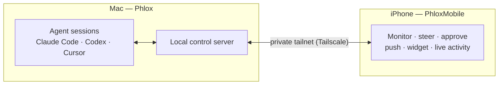

<div align="center">


# Phlox

**在一个原生 macOS 工作台中运行并编排 AI 编程智能体——Claude Code、Codex 和 Cursor——
并通过 iOS 伴侣应用随时随地查看和操控你的会话。**

<a href="https://phlox.cc"></a>

[](LICENSE)
[](#快速开始)
[](https://swift.org)
[](https://developer.apple.com/xcode/swiftui/)

[English](README.md) | [日本語](README.ja.md) | [**简体中文**](README.zh-CN.md) | [한국어](README.ko.md)


</div>

---

Phlox 将一台 Mac 变成 AI 编程智能体的控制室。并排启动多个会话，通过原生终端或结构化聊天
界面驱动每一个会话，并通过你自己的私有网络在手机上随时掌握一切动态——包括审批操作。

## 目录

- [下载](#下载)
- [功能](#功能)
- [工作原理](#工作原理)
- [移动端伴侣](#移动端伴侣)
- [仓库结构](#仓库结构)
- [快速开始](#快速开始)
- [代码签名](#代码签名)
- [安全性](#安全性)
- [贡献](#贡献)
- [许可证与声明](#许可证与声明)

## 下载

试用 Phlox 最快的方式是下载预构建的 macOS 应用——从 **[phlox.cc](https://phlox.cc)** 获取（也可从[最新发布](https://github.com/HMNZK/phlox/releases/latest)直接下载）。若想从源码构建或运行 iOS 伴侣应用，请参阅[快速开始](#快速开始)。

## 功能

- 🧠 **多智能体工作台** — 并排启动并管理多个智能体会话，每个会话拥有独立的 PTY。
  可自由混用自由形式的终端会话与结构化聊天模式。
- 💬 **结构化聊天** — 为受支持的 CLI 提供原生聊天界面，可查看工具调用与子智能体动态、
  设置审批关卡，并显示每轮对话的开销与用量。
- 🗂️ **网格与仪表盘** — 以网格方式排列会话，一览掌握状态，并实时追踪任务完成情况。
- 📱 **移动端伴侣应用** — 一款 iOS 应用，可查看会话、响应审批提示，并通过扫描 QR 码
  重新连接——这一切都在私有覆盖网络中完成。
- 🔔 **随时掌握动态** — 推送通知、主屏幕小组件（Home Screen widget）和 Live Activity
  实时展示会话状态；还可用 Face ID 为应用启动加锁。
- 🔌 **使用你已有的智能体** — 驱动你本机已安装的 Claude Code、Codex 和 Cursor CLI。

## 工作原理

Phlox 在 Mac 本地运行你的智能体 CLI（每个会话对应一个独立的 PTY），并对外暴露一个
小型本地控制服务器。iOS 伴侣应用通过私有的 [Tailscale](https://tailscale.com/) tailnet
连接到该服务器——因此你的手机可以直接访问你的 Mac，数据不会经过任何第三方服务。



## 移动端伴侣

**PhloxMobile** 是 Phlox 的 iOS 端。它通过你的私有 tailnet 连接到 Mac，让你无论身在何处都能持续推进会话——查看哪些会话需要你处理、批准或拒绝命令，并直接在对话中回答智能体的提问。推送通知、主屏幕小组件（Home Screen widget）和 Live Activity 会在锁屏上保持实时状态，Face ID 还可以在启动时对应用进行验证。

<table>
  <tr>
    <td width="33%"></td>
    <td width="33%"></td>
    <td width="33%"></td>
  </tr>
  <tr>
    <td align="center"><sub><b>会话</b> — 查看轮到谁了</sub></td>
    <td align="center"><sub><b>审批</b> — 在手机上批准或拒绝</sub></td>
    <td align="center"><sub><b>对话</b> — 直接回答智能体的提问</sub></td>
  </tr>
</table>

## 仓库结构

这个仓库是包含两个应用的 monorepo。

```
macos/   — the macOS app (SwiftUI + SwiftPM packages, generated with XcodeGen)
ios/     — the iOS companion app (SwiftUI + PhloxKit, generated with XcodeGen)
site/    — the project website and privacy policy (served at phlox.cc)
```

iOS 应用通过仓库内的路径依赖，复用了 macOS 应用中的共享 Swift 包
（`AgentDomain`、`DesignSystem`）。

## 快速开始

### 环境要求

- **macOS 14+** 与 **Xcode 16+**（Swift 6）。
- [XcodeGen](https://github.com/yonaskolb/XcodeGen) — `brew install xcodegen`。
  `.xcodeproj` 文件由 `project.yml` 生成，不会提交到仓库。
- 至少安装一个受支持的智能体 CLI，供 macOS 应用驱动
  （例如 Claude Code、Codex 或 Cursor）。
- **如需使用 iOS 伴侣应用（iOS 17+）：** 需要在 Mac 与手机之间建立私有覆盖网络。
  Phlox 是围绕 [Tailscale](https://tailscale.com/) 设计的——请在两台设备上都安装
  Tailscale 应用并加入同一个 tailnet。Phlox 本身不内置 Tailscale，而是通过你自行
  提供的 tailnet 进行连接。

### 构建 macOS 应用

```bash
cd macos
xcodegen generate
open Phlox.xcodeproj   # then build/run the "Phlox" scheme in Xcode
```

在不构建整个应用的情况下运行包测试：

```bash
cd macos/Packages/<PackageName> && swift test
```

### 构建 iOS 伴侣应用

```bash
cd ios
xcodegen generate
open PhloxMobile.xcodeproj   # build/run on a simulator or device
```

## 代码签名

仓库中提交的 `project.yml` 文件自带**空的 `DEVELOPMENT_TEAM`**，因此仓库本身不携带
任何个人签名身份。若要在真机上构建或进行分发，请设置你自己的 Apple Developer Team ID——
可以在 Xcode 的 “Signing & Capabilities” 标签页中设置，也可以通过本地的
`Signing.local.xcconfig` 文件设置（参见 [`Signing.example.xcconfig`](Signing.example.xcconfig)）。
模拟器与本地测试构建不需要 Team。

## 安全性

Phlox 会远程控制一台 Mac 并运行本地控制服务器，因此我们非常重视安全报告。请通过私下渠道
报告漏洞——详见 [SECURITY.md](SECURITY.md)。请勿为安全问题创建公开 issue。

## 贡献

欢迎提交 issue 和 pull request。本项目不提供支持保证——它是在 MIT 许可证下按“原样”提供的。

## 许可证与声明

Phlox 基于 [MIT 许可证](LICENSE) 发布。所捆绑的第三方组件与商标列于
[THIRD_PARTY_NOTICES.md](THIRD_PARTY_NOTICES.md)。

Phlox 是一个独立项目，与 OpenAI、Anthropic、Anysphere 或 Tailscale 均无关联；文中出现的
相关名称与商标仅用于表明兼容性。
</content>
</invoke>
